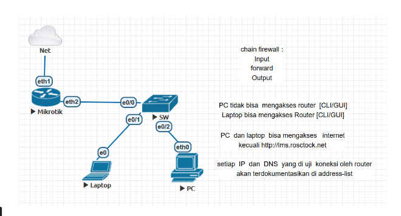

# LAB-22-Firewall---chain-input-forward-output
tanggal 16 Agustus 



# Firewall – chain input, forward, output 

**Input** → Mengatur koneksi menuju router Mikrotik (CLI/GUI, Winbox, SSH, dll).   
**Forward** → Mengatur lalu lintas yang melewati router (internet atau antar jaringan).   
**Output** → Mengatur koneksi yang keluar dari router itu sendiri.   

# Langkah Konfigurasi Firewall di Mikrotik
1. Blokir PC agar tidak bisa akses Router (CLI/GUI)

```bash
/ip firewall filter add chain=input src-address=IP_PC action=drop comment="Block PC access to router"
```

Contoh:

```bash
/ip firewall filter add chain=input src-address=192.168.1.2 action=drop
```

* Laptop tidak diblokir, sehingga tetap bisa akses router.

2. Izinkan Akses Internet untuk semua bagi pc dan laptop Kecuali Situs Tertentu
    situs `lms.rosctock.net` diblokir.
   
```bash
/ip firewall filter add chain=forward dst-address-list=blocked-sites action=drop comment="Block specific sites"
/ip firewall address-list add list=blocked-sites address=lms.rosctock.net
```

3. Dokumentasikan IP dan DNS yang Diuji Router

```bash
/ip firewall address-list add list=log-access address=0.0.0.0/0
```

Lalu tambahkan rule logging:

```bash
/ip firewall filter add chain=forward action=log log-prefix="FORWARD_TRAFFIC" 
```

Semua IP yang lewat akan masuk ke log dan bisa dilihat di **Log Mikrotik**.


4. Chain Output – Batasi Koneksi Keluar Router

Misalnya, agar router tidak mengakses situs tertentu:

```bash
/ip firewall filter add chain=output dst-address-list=blocked-sites action=drop
```

# pengujian 

* PC tidak bisa akses router (Winbox/SSH).
* Laptop tetap bisa akses router.
* Semua perangkat bisa internet kecuali situs tertentu.
* Semua IP/DNS yang diakses router terekam dalam address-list.


# Kesimpulan

Dengan memanfaatkan **chain: input, forward, dan output**, 
kita dapat mengatur keamanan jaringan secara spesifik
