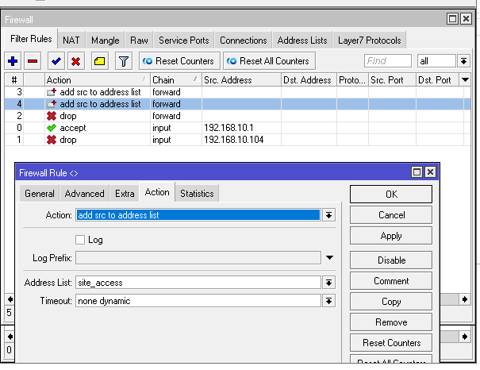

# LAB-22-Firewall---chain-input-forward-output
tanggal 16 Agustus 

# Firewall – chain input, forward, output 

**Input** → Mengatur koneksi menuju router Mikrotik (CLI/GUI, Winbox, SSH, dll).   
**Forward** → Mengatur lalu lintas yang melewati router (internet atau antar jaringan).   
**Output** → Mengatur koneksi yang keluar dari router itu sendiri.   

# Langkah Konfigurasi Firewall di Mikrotik
1. Lakukan konfigurasi awal Mikrotik seperti membuat IP Static, DHCP Client, DHCP Server, dan NAT.
   Sampai Laptop terhubung dan bisa mengakses internet.

2. Setting DHCP static lease agar IP tidak berubah.

  /ip dhcp-server lease add address=192.168.10.104 mac-address=00:90:F5:C7:5C:5C  

3. Setting firewall rules di IP > FIREWALL > FILTER.

4. Tambahkan domain ke address list
 

5. Lalu block di forward 
 

6. Sekarang buat agar semua IP client & situs yang diakses masuk address-list. IP > FIREWALL > FILTER RULES.

7. Buat agar semua aktivitas client tercatat di IP > FIREWALL > address-list.
   

8. Sekarang Laptop bisa akses router, PC tidak bisa akses router, keduanya bisa internet, lms.roscock.net tidak bisa dibuka, semua client & situs yang diakses terekam di address-list.
   
  

# pengujian 

* PC tidak bisa akses router (Winbox/SSH).
* Laptop tetap bisa akses router.
* Semua perangkat bisa internet kecuali situs tertentu.
* Semua IP/DNS yang diakses router terekam dalam address-list.

# Kesimpulan

Dengan memanfaatkan **chain: input, forward, dan output**, 
kita dapat mengatur keamanan jaringan secara spesifik
